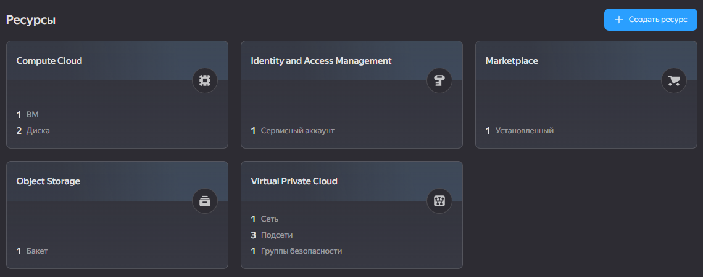
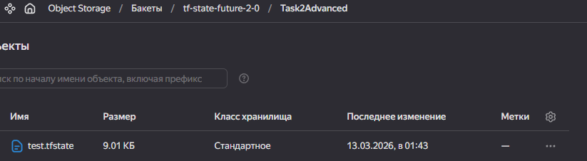

# Задание 2. Интеграция с CI/CD и удалённым хранением состояния

## Terraform-конфигурация [main.tf](./main.tf)

Используется Yandex Object Storage (S3-совместимый) для удалённого хранения файла состояния (test.tfstate).

Параметры: bucket должен быть создан заранее. Ключи доступа передаются через переменные окружения или -backend-config при init.

Создаёт ВМ в Yandex Compute Cloud с двумя дисками (загрузочный и дополнительный).

Использует образ Ubuntu 22.04 LTS.

Для SSH-доступа используется публичный ключ, переданный через переменную ssh_key.

Переменные, которые необходимо передать (через .tfvars или -var)

- vm_name - имя ВМ
- cores - количество ядер
- memory - объём RAM (ГБ)
- disk_size_gb - размер дополнительного диска
- zone - зона доступности (по умолчанию ru-central1-a)
- subnet_id - ID подсети (должна существовать)
- ssh_key - публичный SSH-ключ

## Настройка секретов GitHub Actions

Для работы пайплайна необходимо добавить следующие секреты в репозиторий

| Secret         | Описание                                                 |
| -------------- | -------------------------------------------------------- |
| YC_TOKEN       | OAuth-токен или IAM-токен для доступа к Yandex Cloud     |
| YC_CLOUD_ID    | ID вашего облака                                         |
| YC_FOLDER_ID   | ID каталога, где создаются ресурсы                       |
| YC_ACCESS_KEY  | Static Access Key сервисного аккаунта с правами на бакет |
| YC_SECRET_KEY  | Соответствующий секретный ключ                           |
| SSH_PUBLIC_KEY | Публичный SSH-ключ (содержимое id_ed25519.pub)           |
| SUBNET_ID      | ID существующей подсети в каталоге                       |

## CI/CD пайплайн [pipeline.yml](./pipeline.yml)

Пайплайн состоит из двух jobs: plan и apply

### Job: plan

Запускается только для событий pull_request в ветку main

Действия:

1. Checkout кода
2. Установка Terraform указанной версии (1.14.7).
3. terraform init с передачей ключей доступа к бэкенду.
4. terraform validate - проверка синтаксиса.
5. terraform plan с передачей всех переменных (SSH-ключ, имя ВМ и др.). Результат сохраняется в файл tfplan.
6. Загрузка файла tfplan как артефакта (для последующего применения).

### Job: apply

Запускается только при пуше в ветку main (после слияния PR)

Зависит от успешного выполнения plan

Действия:

1. Checkout, установка Terraform, init (аналогично plan).
2. Скачивание артефакта tfplan, созданного на этапе plan.
3. terraform apply с использованием сохранённого плана (гарантирует применение именно тех изменений, что были запланированы).

### Безопасность: Ключи доступа передаются через -backend-config и не хранятся в коде.

## Локальный запуск (без CI/CD)

Для локального тестирования необходимо выполнить

```
cd Task2Advanced
export $(cat .env | xargs)
terraform init \
  -backend-config="access_key=$YC_ACCESS_KEY" \
  -backend-config="secret_key=$YC_SECRET_KEY"
terraform plan \
  -var="ssh_key=$(cat ~/.ssh/id_ed25519.pub)" \
  -var="vm_name=test-vm" \
  -var="cores=2" \
  -var="memory=4" \
  -var="disk_size_gb=10" \
  -var="zone=ru-central1-a" \
  -var=subnet_id=$SUBNET_ID \
  -out=tfplan
terraform apply -auto-approve tfplan
```

## Подготовка инфраструктуры (бакет)

Перед первым запуском необходимо вручную создать S3-бакет (например, через консоль Yandex Cloud или CLI)

Также рекомендуется создать таблицу блокировок в YDB для предотвращения конкурентного доступа к state

## Заключение

Данная конфигурация обеспечивает:

- Централизованное хранение состояния в защищённом бакете
- Автоматическую проверку изменений в Pull Request
- Контролируемое применение после слияния
- Изоляцию секретов через GitHub Secrets

Для расширения функциональности можно добавить несколько окружений (dev/stage/prod) с отдельными файлами состояния и разными наборами переменных

## Демонстрация работы


Скриншот создания ресурсов

<div align="center">



</div>

Скриншот файла состояния Terraform в облачном хранилище S3

<div align="center">



</div>