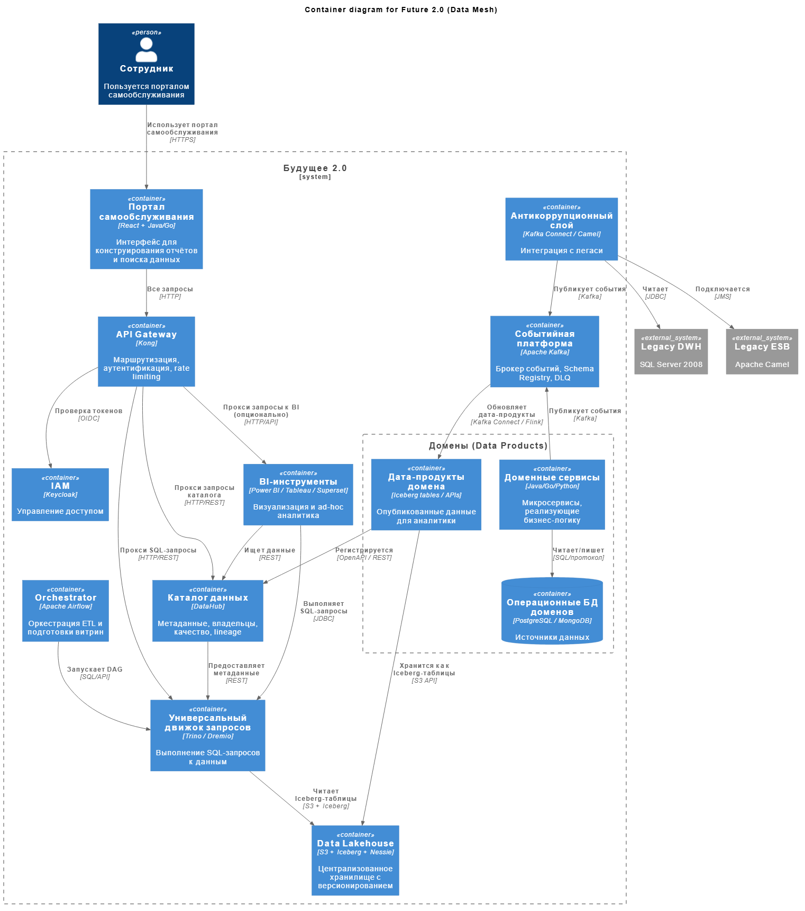

# Задание 3. Проектирование целевой архитектуры и оценка рисков внедрения

## 1. Целевая архитектура системы «Будущее 2.0» в горизонте трёх лет

### 1.1 Диаграмма контейнеров в нотации C4

[Диаграмма контейнеров в нотации C4](./C4_Container.puml)

### 1.2 Изменения ключевых систем при масштабировании

| Существующая система                     | Целевое состояние                                                                                     | Изменения и обоснование                                                                                                                          |
| ---------------------------------------- | ----------------------------------------------------------------------------------------------------- | ------------------------------------------------------------------------------------------------------------------------------------------------ |
| DWH (SQL Server 2008)                    | Упраздняется, остаётся только как архив или ACL.                                                      | Заменяется на Data Mesh: домены владеют своими данными, аналитические витрины строятся на событиях. Это снижает связанность и повышает гибкость. |
| Power BI (с кастомизациями)              | Интегрируется с порталом самообслуживания, остаётся как один из инструментов BI.                      | Кастомизации выносятся в дата-продукты доменов или заменяются на самописные решения на портале.                                                  |
| ESB на Apache Camel                      | Используется как антикоррупционный слой для легаси, затем выводится из эксплуатации.                  | Заменяется событийной платформой, обеспечивающей слабую связанность и реактивность.                                                              |
| ИИ-сервисы на Python                     | Становятся полноценными доменами (например, "AI Diagnostics"), публикуют события и предоставляют API. | Интеграция через события, данные для обучения берутся из Data Lakehouse.                                                                         |
| Финтех-сервисы (Golang/Java)             | Разбиваются на микросервисы по доменам (кредиты, платежи, счета) с собственными БД.                   | Повышение автономности, возможность независимого масштабирования.                                                                                |
| Медицинская система (PowerBuilder + DWH) | Заменяется современной МИС, построенной на микросервисах и событиях.                                  | Поэтапная миграция, использование ACL для сохранения функциональности.                                                                           |
| Нет портала самообслуживания             | Создаётся портал, позволяющий бизнесу самостоятельно строить отчёты.                                  | Снижение time-to-market для аналитики, сокращение нагрузки на ИТ.                                                                                |

### Новые бизнес-направления

Например, фармацевтика, производство оборудования будут подключаться как новые домены, которые публикуют свои события и потребляют события других доменов через событийную платформу. Это позволяет легко расширять экосистему без изменения существующих систем.

### Интеграция дополнительных источников данных

Например, данные с медицинских устройств, внешние API реализуется через создание адаптеров (Kafka Connect), которые публикуют входящие данные как события в соответствующих доменах.

## 2. Карта рисков трансформации

| Риск                                                                  | Категория       | Вероятность | Влияние       | Пояснение                                                                                                             |
| --------------------------------------------------------------------- | --------------- | ----------- | ------------- | --------------------------------------------------------------------------------------------------------------------- |
| 1. Потеря данных при миграции из легаси-систем                        | Технологический | Средняя     | Высокое       | Неполный перенос исторических данных, ошибки конвертации.                                                             |
| 2. Несовместимость форматов событий между доменами                    | Архитектурный   | Средняя     | Среднее       | Разные домены могут использовать разные схемы, что затруднит интеграцию.                                              |
| 3. Увеличение сложности управления доступом и безопасностью           | Архитектурный   | Высокая     | Высокое       | Распределённая архитектура усложняет контроль доступа к данным, особенно с учётом медицинских и финансовых регуляций. |
| 4. Недостаточная пропускная способность событийной платформы          | Технологический | Низкая      | Среднее       | При резком росте числа событий может потребоваться масштабирование Kafka.                                             |
| 5. Сопротивление сотрудников переходу на новые инструменты            | Организационный | Высокая     | Среднее       | Бизнес-пользователи привыкли к старым отчётам, новый портал может быть встречен негативно.                            |
| 6. Затягивание сроков из-за параллельной поддержки легаси             | Организационный | Средняя     | Высокое       | Необходимость поддерживать две системы одновременно может отвлекать ресурсы.                                          |
| 7. Нарушение регуляторных требований (медицинские, финансовые данные) | Организационный | Низкая      | Очень высокое | Ошибки в разграничении доступа или утечки данных могут привести к санкциям.                                           |
| 8. Отсутствие единых стандартов для дата-продуктов                    | Архитектурный   | Средняя     | Среднее       | Без стандартов домены будут создавать витрины по-разному, что затруднит их использование на портале.                  |
| 9. Недостаточная производительность запросов к Data Lakehouse         | Технологический | Средняя     | Среднее       | Сложные запросы могут выполняться долго без оптимизации.                                                              |
| 10. Риск vendor lock-in при выборе облачных провайдеров               | Технологический | Низкая      | Среднее       | Использование специфических сервисов может усложнить переход между облаками.                                          |

## 3. План управления рисками

### 3.1. Технические меры

| Риск                                    | Мера                                                                                                                                                                                                                                              |
| --------------------------------------- | ------------------------------------------------------------------------------------------------------------------------------------------------------------------------------------------------------------------------------------------------- |
| 1. Потеря данных                        | - Разработка детального плана миграции с выверкой целостности данных.   - Использование инструментов ETL/ELT с возможностью повторной загрузки.   - Создание резервных копий и проверка после миграции.                                     |
| 2. Несовместимость схем                 | - Внедрение Schema Registry с обязательным использованием для всех событий.   - Согласование общих контрактов между доменами на архитектурном комитете.   - Использование форматов, поддерживающих обратную совместимость (Avro, Protobuf). |
| 3. Безопасность и доступ                | - Централизованное IAM с политиками на уровне доменов и атрибутов (ABAC).   - Внедрение Data Loss Prevention (DLP) для мониторинга утечек.   - Регулярные аудиты доступа и шифрование данных (в покое и при передаче).                      |
| 4. Пропускная способность Kafka         | - Проектирование с запасом, использование партиционирования.   - Мониторинг нагрузки и автоматическое масштабирование кластера.   - Тестирование под пиковыми нагрузками.                                                                   |
| 5. Регуляторные требования              | - Построение системы согласно стандартам (GDPR, HIPAA, 152-ФЗ).   - Использование сертифицированных облачных регионов.   - Регулярные пентесты и аудиты безопасности.                                                                       |
| 6. Отсутствие стандартов дата-продуктов | - Разработка и документирование стандартов для дата-продуктов (метаданные, форматы, качество).   - Внедрение Data Catalog с автоматической проверкой соответствия.                                                                             |
| 7. Производительность запросов          | - Использование специализированных форматов (Parquet, ORC) и партиционирования в Data Lakehouse.   - Кэширование часто используемых витрин.   - Применение MPP-движков (Presto, ClickHouse) для сложных запросов.                           |
| 8.  Vendor lock-in                      | - Предпочтение открытым технологиям и облачно-нейтральным решениям.   - Использование абстракций (Terraform, Kubernetes) для переносимости.   - Проектирование мультиоблачной стратегии.                                                    |

### 3.2. Управленческие меры

| Риск                                  | Мера                                                                                                                                                                                                                |
| ------------------------------------- | ------------------------------------------------------------------------------------------------------------------------------------------------------------------------------------------------------------------- |
| 1. Сопротивление сотрудников          | - Проведение тренингов и демонстраций нового портала.   - Вовлечение ключевых пользователей в пилотный проект.   - Постепенный вывод старых отчётов с параллельным доступом к новым.                          |
| 2. Затягивание сроков                 | - Использование итеративного подхода (Agile), поставка MVP для одного домена.   - Выделение отдельной команды для поддержки легаси на время миграции.   - Чёткое планирование с учётом зависимостей.          |
| 3. Регуляторные риски (дополнительно) | - Включение compliance-специалистов в команду с самого начала.   - Регулярные встречи с регуляторами для согласования подхода.   - Автоматизация комплаенс-контроля (например, проверка анонимизации данных). |